# Wiz Project Architecture

This document describes the system architecture and data flow of the Wiz project.

## System Architecture Flow

```mermaid
flowchart TD
    A[Start application] --> B[Initialize async channels]
    B --> C[Spawn API poller task]
    B --> F[Spawn export manager task]

    %% API Poller Task
    C --> G[Fetch data from API]
    G --> H[Heartbeat log after data is fetched]
    H --> I[Initialize and pass data to processing task]
    I --> K[Initialize data processor task]

    I --> J[Wait for 20s timer to tick]
    J --> G

    %% Data Processor Task
    K --> L{New data available?}
    L -->|Yes| M[Record event and start routine mini-processing]
    L -->|No| N[Record event]
    L -->|Error| O[Record event and log API error]

    M --> P[Is first snapshot?]
    P --> |Yes| Q[Initialize product states]

    %% Product States Subgraph
    subgraph Product states
      direction TB
      Q_START(For each product) --> Q_A[Create a product states field with the following states]
      Q_A --> Q_B[Initialize snapshots count, windows processed, and starting timestamp]
      Q_B --> Q_C[Initialize price list with current price in it]
      Q_C --> Q_D["Initialize MovingWeek deltas list (should have no negative numbers and should be empty on initialization)"]
      Q_D --> Q_E["Initialize summaries deltas list (list of dictionaries with events as the dictionaries, and the amount of orders dissapeared/modified and the size of those changes as the keys)"]
      Q_E --> Q_F["Initialize new demand/supply deltas (size and amount of new offers)"]

    end
    
    
    Q --> Q_START
    Q_F --> G
    P --> |No| R[Update product states]

    %% Update Logic Subgraph
    subgraph Update Logic
        direction TB
        R_START(For each product in snapshot) --> R_A{Compare with stored state}
        R_A -->|Changed| R_B{What changed?}
        R_A -->|Unchanged| R_C[Append the current price and both the MovingWeek and summaries delta to their respective lists in the product states]
        R_C --> R_G
    
        R_B -->|Price| R_D[Append new price to the price list in product states]
        R_B -->|MovingWeek| R_E[Subtract previous snapshot MovingWeek from current snapshot MovingWeek, then append this delta to the MovingWeek list in product states]
        R_B -->|Summaries| R_F["Compare and mark changes from previous summaries, the append the amount of orders that dissapeared/appeared orders and the size of those changes (i.e. {orders affected: 2, size 1: +100, size 2: +50}, {orders affected: 3, size 1: -100, size 2: -20, size 3: -5}"]
        R_D --> R_G[Update process finished]
        R_E --> R_G
        R_F --> R_G
        R_G --> R_H[Is the number of snapshots fetched 180?]
        
    end
    
    %% Connecting the main flow to the subgraph
    R --> R_START
    R_H --> |No| G
    R_H --> |Yes| S[Begin end of hour processing]

    %% End of hour processing
    S --> T[Average out the price list]
    S --> U[Calculate how often new orders appear and their average size]
    S --> V[Calculate sell/buy events]
    subgraph Insta-Events/Hour Logic
        direction TB
        V_A(For each product in product states) --> V_B["Confirm amount of windows (179)"]
        V_B --> V_C[Process summaries data]
        V_B --> V_D[Process MovingWeek data]
        V_C --> V_E["Eliminate positive size summary deltas (maximum 0, none should ever be mixed because they would cancel each other out and remain undetected)"]
        V_E --> V_F["Sum up the sizes of the negative summary deltas and discard the 'orders affected' field. There should be a clean list of numbers left"]
        V_F --> V_G[Take the absolute value of the summary deltas]
        V_G --> V_H[Match up data points and put lists side by side]    
        V_D --> V_H
        V_H --> V_I[Divide summaries data points by corresponding MovingWeek data points to get a list of ratios, and if MovingWeek is 0, return N/A]
        V_I --> V_J[Sort the ratio-index pairs by ratio value in ascending order]

        %% Candidacy Generation
        V_J --> V_K[Set N=3 where N is the size of the group of candidacy, and if there is anything less than 3 that's put through we have no need for scaling up, the purpose of this section of the algorithm]
        V_K --> V_L["Is N 180? (for analysis up to N=179)"]
        V_L --> |No| V_M[Generate possible candidates by taking each consecutive list of N values]
        V_M --> V_N[For each candidate of size N...]
        V_N --> V_O[Are all candidates of size N processed?]
        V_O --> |No| V_P[Go to the next candidate]
        V_P --> V_Q[Calculate variance of each ratio, which is the score for the homogenity of the candidate, and store both the candidate and the score in memory]
        V_Q --> V_R["Calculate the variance of each excluded ratio (high is good), which tells us the noise and the quality of the information left behind"]
        V_O --> |Yes| V_S[Add 1 to N]
        V_S --> V_L
        V_L --> |Yes| V_T[Exit loop]

        %% Pattern Detection
        V_R --> V_U[For each candidate and it's respective indices for each of its values, calculate the rhythm of its frequency]
        V_U --> V_V[Sort the event chronologically]
        V_V --> V_W[Calculate the time difference between each consecutive events]
        V_W --> V_X[Calculate the mean of the periods]
        V_X --> V_Y[Calculate the variance for the candidate, which is the score for the rhythm of the candidate]
        V_Y --> V_Z[Store the candidate, the homogenity score, the rhythm score, and the exclusion score]
        V_Z --> V_O
        
        %% Normalization
        V_T --> V_AA[Take the best and worst scores of the homogenity of the candidates and assign them to 0 and 1 where 0 is the most homogenous and 1 is the least]
        V_T --> V_AB[Take the best and worse scores of the rhythm of the candidates and assign them to 0 and 1 where 0 is the most rhythmic and 1 is the least]
        V_T --> V_AC["Take the best and worse scores of the exclusion of the candidates and assign them to 0 and 1 where 1 is high quality excluded information (bad) and 0 is the low quality noise (good)"]
        V_AA --> V_AD[Add the homogenity, rhythm scores, and the exclusion together for each candidate and check and return the best candidate]
        V_AB --> V_AD
        V_AC --> V_AD
        V_AD --> V_AE["A consistent pattern with N elements was identified and is the most consistent when analyzed"]
        V_AE --> V_AF[Take the original MovingWeek list and identify the indices that were marked on the winning candidate]
        V_AF --> V_AG[Average the points on those indices, then use the -----]
    end

    V --> V_A
```

## Key Components

### Data Flow
1. **API Poller Task** - Continuously fetches data from external APIs
2. **Data Processor Task** - Processes incoming data and maintains product states
3. **Product States Management** - Tracks product history and changes
4. **Pattern Detection** - Identifies market patterns using statistical analysis

### Processing Logic
- **Update Logic**: Compares new data with stored states and records changes
- **Candidacy Generation**: Creates possible pattern candidates for analysis
- **Pattern Detection**: Uses variance and rhythm scoring to identify patterns
- **Normalization**: Scores patterns on homogeneity, rhythm, and exclusion quality

### Window Management
- Uses 180 windows (1 hour) as the target processing unit
- 20-second polling intervals for real-time data collection
- Maintains moving averages and delta calculations